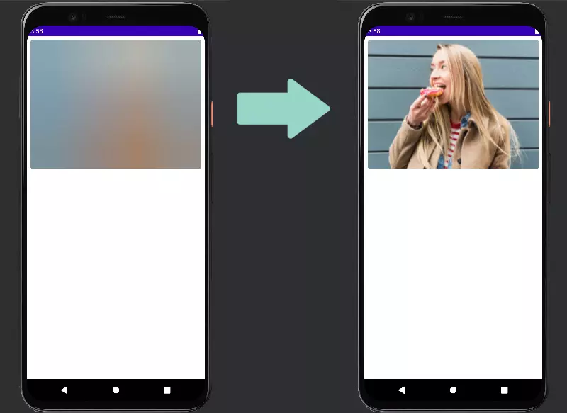
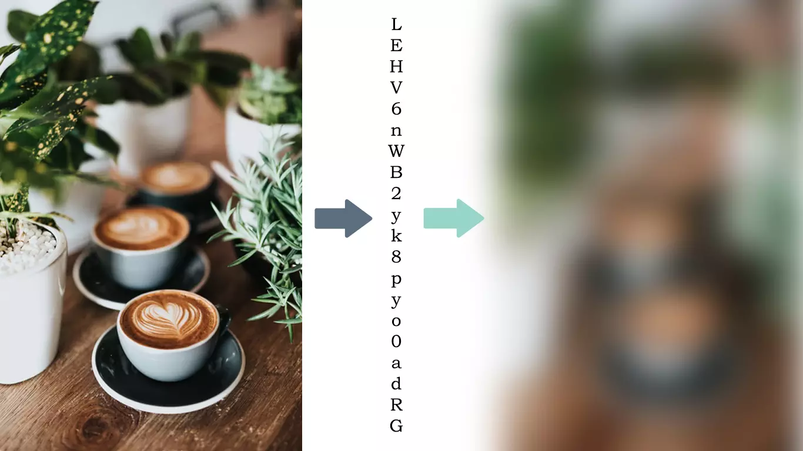

# compose-image-blurhash [](https://jitpack.io/#orlando-dev-code/compose-image-blurhash)

ComposeImageBlurhash is a Jetpack Compose component with the necessary implementation to display a blurred image while the real image is loaded from the internet.
Use blurhash and coil to ensure good performance.



## Coil
The Coil library is used to load the images asynchronously

You can find more information here [github](https://github.com/coil-kt/coil)!

## More from Blurhash
BlurHash is a compact representation of a placeholder for an image.



You can also see nice examples and try it out yourself at 
[blurha.sh](http://blurha.sh/)!

All blurhash code is here 
[github](https://github.com/woltapp/blurhash)!

## Users
Who uses ComposeImageBlurhash? :

Inmersoft - At Immersoft we use ComposeImageBlurhash for a better user experience when loading and displaying images to the end user.

#How to use

- In the AndroidManifest add the permissions to use the Internet

        <uses-permission android:name="android.permission.INTERNET" />
        
- In the build.gradle add the necessary dependencies

        implementation 'com.github.orlando-dev-code:compose-image-blurhash:2.1.0'

- Add component as required
```
        class MainActivity : ComponentActivity() {
        @ExperimentalCoilApi
        override fun onCreate(savedInstanceState: Bundle?) {
            super.onCreate(savedInstanceState)
            setContent {
                TestImageBlurLibraryTheme {
                    // A surface container using the 'background' color from the theme
                      Surface(color = MaterialTheme.colors.background) {
                         TestImageBlurhash()
                      }
                  }
              }
          }
       }

        @ExperimentalCoilApi
        @Composable
        fun TestImageBlurhash() {
             
        val data = IBlurModel(imageUrl = "https://blurha.sh/assets/images/img2.jpg", blurHash = "LGF5]+Yk^6#M@-5c,1J5@[or[Q6.")
         Column {
               Card(
                modifier = Modifier
                    .height(cardHeight)
                    .fillMaxWidth()
                    .padding(8.dp),
                shape = MaterialTheme.shapes.small
            ) {
                AsyncBlurImage(
                    modifier = Modifier.fillMaxSize(),
                    data = data,
                    notImageFoundRes = R.drawable.ic_no_image,
                    contentDescription = "Image Blurhash Used"
                )
            }
        }
```
